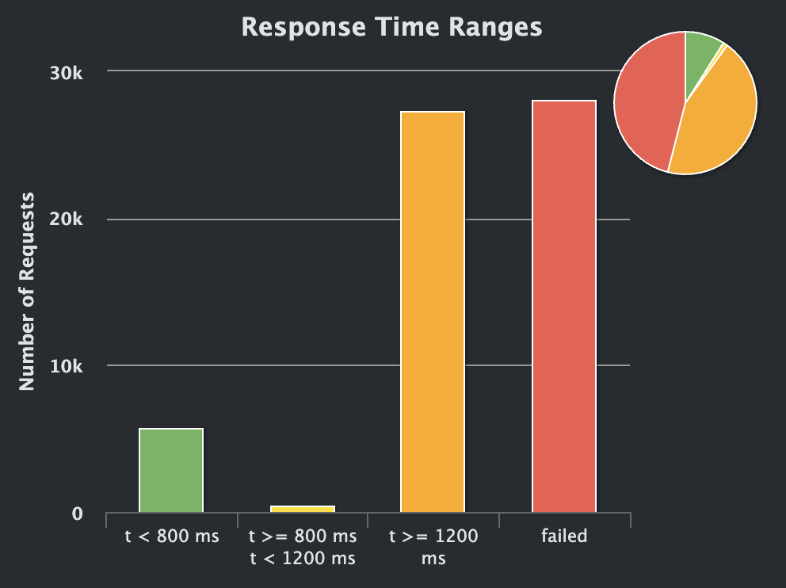
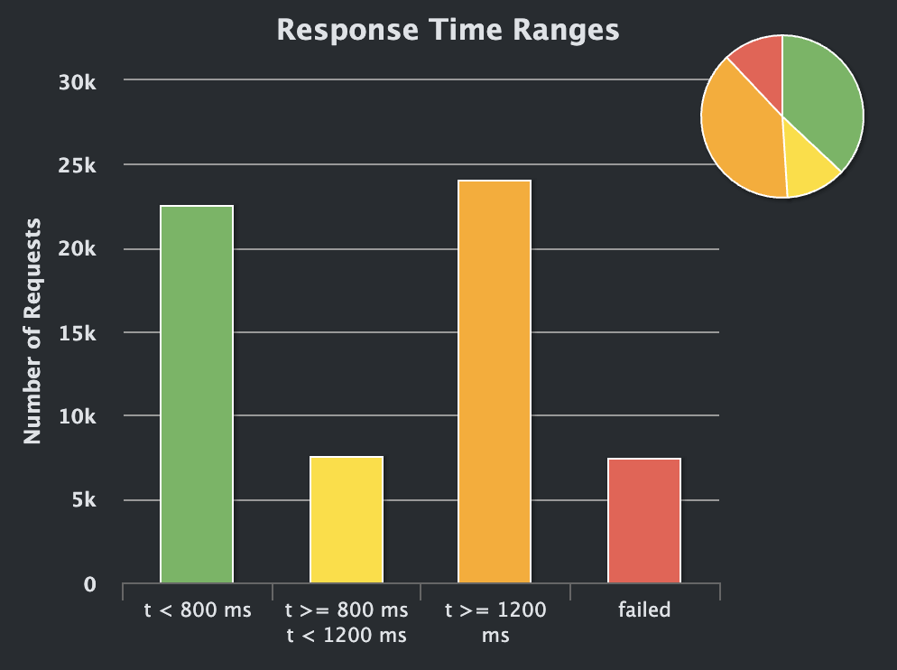
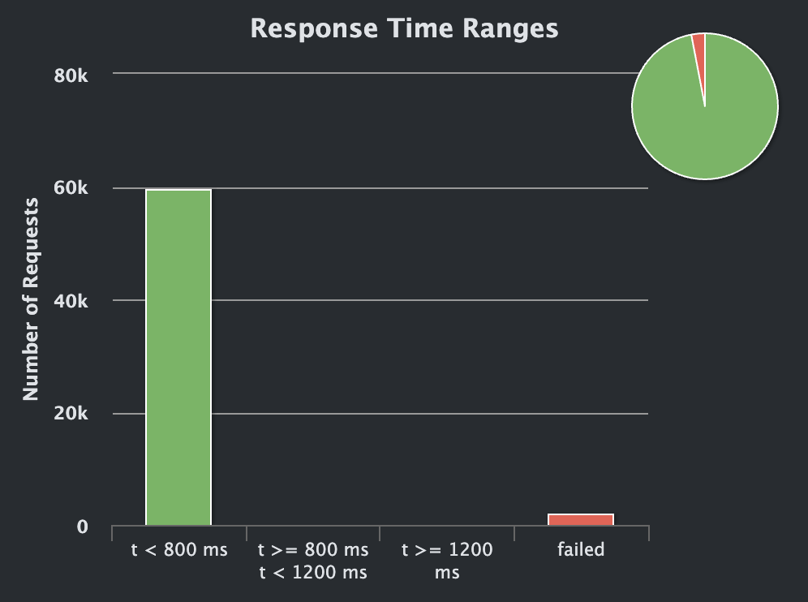

# Rinha de Backend 2024 Q1 — PHP + Symfony

Implementação da **Rinha de Backend 2024 — Q1** utilizando PHP, Symfony, PostgreSQL, FrankenPHP e Nginx.

Este projeto não nasceu com o objetivo de conquistar a melhor posição possível no ranking ou competir com as implementações mais otimizadas da Rinha.

O objetivo foi outro: **usar a Rinha como laboratório para estudar PHP, concorrência, bancos de dados, Docker, performance e comportamento de aplicações sob carga**.

A ideia foi começar com uma implementação simples e funcional e, a partir de testes de carga, descobrir os gargalos empiricamente, alterando uma coisa de cada vez e medindo novamente.

No processo, algumas das minhas próprias percepções sobre PHP mudaram bastante.

---

## Por que PHP?

Eu já trabalho e tenho experiência com outras linguagens e ecossistemas de backend, mas PHP sempre me chamou atenção.

Não havia uma razão muito objetiva para isso. Eu simplesmente queria entender melhor a linguagem e descobrir como seria desenvolver uma aplicação com requisitos de concorrência e performance utilizando PHP.

A Rinha pareceu um ótimo laboratório para isso.

No começo, utilizando o servidor embutido do PHP, os resultados foram muito ruins. A primeira impressão foi praticamente:

> "Talvez PHP seja realmente lento."

Mas isso acabou sendo uma conclusão completamente errada.

Conforme fui entendendo melhor o runtime, trocando o servidor HTTP, utilizando FrankenPHP e posteriormente seu **worker mode**, ficou evidente que o problema não era simplesmente "PHP é lento".

A arquitetura e o modelo de execução importavam — e muito.

O mesmo código de negócio passou de respostas na casa dos **segundos** para respostas na casa dos **milissegundos** depois dessas mudanças.

Esse provavelmente foi o maior aprendizado do projeto.

---

## Stack

A implementação utiliza:

* PHP
* Symfony
* PostgreSQL
* Doctrine DBAL
* FrankenPHP
* Nginx
* Docker / Docker Compose
* Gatling

A arquitetura final ficou aproximadamente assim:

```text
                        :9999
                          │
                          ▼
                       Nginx
                  Load Balancer
                     /       \
                    /         \
                   ▼           ▼
              ┌────────┐  ┌────────┐
              │ API 01 │  │ API 02 │
              │Symfony │  │Symfony │
              │Franken │  │Franken │
              └────┬───┘  └───┬────┘
                   │          │
                   └────┬─────┘
                        ▼
                   PostgreSQL
```

As duas instâncias da aplicação são stateless.

Todo estado necessário para garantir consistência entre as instâncias fica no PostgreSQL.

---

# Concorrência

Um dos principais motivos para escolher a Rinha de Backend 2024 foi estudar concorrência.

O endpoint:

```text
POST /clientes/{id}/transacoes
```

pode receber várias transações simultaneamente para o mesmo cliente.

Uma transação de débito nunca pode fazer com que:

```text
saldo < -limite
```

O problema fica interessante quando duas ou mais requisições tentam alterar o mesmo saldo simultaneamente.

Durante o desenvolvimento foram estudadas diferentes estratégias, incluindo:

```sql
SELECT ... FOR UPDATE
```

e uma abordagem utilizando atualização condicional atômica.

A implementação final utiliza:

```sql
UPDATE clientes
SET saldo = ...
WHERE id = ...
  AND ...
RETURNING saldo, limite;
```

A validação do limite acontece dentro da própria operação executada pelo PostgreSQL.

Isso evita o clássico fluxo:

```text
SELECT saldo
↓
valida na aplicação
↓
UPDATE saldo
```

que criaria uma janela para race conditions.

A ideia foi deixar o PostgreSQL participar diretamente da garantia de consistência.

---

# Por que PostgreSQL?

PostgreSQL foi escolhido desde o início principalmente pelo interesse em estudar como um banco relacional pode ser utilizado para resolver problemas de concorrência e consistência.

Em vez de tentar coordenar as duas instâncias da API utilizando estado em memória:

```text
API 01 ──┐
         ├── PostgreSQL
API 02 ──┘
```

o banco funciona como o ponto compartilhado de consistência.

Isso também permitiu manter as APIs stateless, característica importante quando existem múltiplas instâncias atendendo as mesmas requisições.

---

# Desenvolvimento orientado por experimentos

Uma das regras que tentei seguir durante o projeto foi:

> **Não otimizar baseado apenas em intuição. Medir primeiro.**

O processo utilizado foi aproximadamente:

```text
Implementação
     ↓
Teste Gatling
     ↓
Observar métricas
     ↓
Criar hipótese
     ↓
Alterar uma variável
     ↓
Executar novamente
     ↓
Comparar resultados
```

Em vez de trocar várias configurações simultaneamente, tentei fazer pequenas alterações e observar empiricamente o impacto.

Isso permitiu entender não apenas **o que melhorava a performance**, mas principalmente **por que melhorava**.

Algumas métricas observadas durante os testes foram:

* throughput;
* p50;
* p95;
* p99;
* quantidade de requests OK/KO;
* CPU dos containers;
* memória;
* erros de conexão;
* comportamento do PostgreSQL.

Esse processo acabou sendo uma das partes mais interessantes do projeto.

---

# `network_mode: host`

Uma das alterações realizadas durante os experimentos foi mudar o networking utilizado pelos containers.

Inicialmente utilizei a rede padrão do Docker.

Depois de assistir ao vídeo do **Fabio Akita sobre a Rinha de Backend de 2023**, resolvi experimentar:

```yaml
network_mode: host
```

A intenção era reduzir parte do overhead relacionado ao networking virtual do Docker no ambiente utilizado para os testes.

A mudança apresentou melhora mensurável nos testes locais e passou a fazer parte do baseline utilizado nos experimentos seguintes.

Essa decisão também representa bem a filosofia adotada no projeto:

```text
ideia
↓
hipótese
↓
teste
↓
medição
↓
decisão
```

Não simplesmente:

```text
"alguém disse que é mais rápido"
↓
usar
```

---

# Evolução de performance

Esta foi provavelmente a parte mais surpreendente do projeto.

As mudanças de infraestrutura e runtime tiveram impacto muito maior do que pequenas otimizações no código da aplicação.

## 1. Servidor padrão do PHP

A primeira implementação utilizava o servidor embutido:

```bash
php -S 0.0.0.0:8080 -t public
```

O resultado foi muito ruim.

Um dos primeiros testes apresentou:

```text
Requests:       61.503
OK:             32.797
KO:             28.706

OK p50:         2.084 ms
OK p95:         6.775 ms
OK p99:         7.505 ms

Premature close: 27.740
```

Quase metade das requisições falhava.

As duas APIs também permaneciam próximas do limite de CPU configurado.

Foi nesse momento que comecei a suspeitar que o problema não estava necessariamente no código de negócio ou no PostgreSQL, mas na maneira como a aplicação PHP estava sendo executada.

### Resultado do Gatling




---

# 2. Docker Host Network + FrankenPHP

O próximo passo importante foi substituir o servidor embutido pelo **FrankenPHP**.

A arquitetura passou de:

```text
Nginx
  ↓
php -S
  ↓
Symfony
```

para:

```text
Nginx
  ↓
FrankenPHP
  ↓
Symfony
```

Mantendo também o experimento com:

```yaml
network_mode: host
```

Somente essa mudança já mostrou que o servidor utilizado para executar PHP tinha um impacto enorme no resultado.

### Resultado do Gatling




---

# 3. FrankenPHP Worker Mode

Então veio a mudança que mais me surpreendeu durante todo o projeto.

O FrankenPHP possui um **worker mode**, no qual a aplicação permanece inicializada entre as requisições.

No modelo tradicional, existe trabalho de inicialização associado ao ciclo de cada request.

De forma simplificada:

```text
Request
↓
Bootstrap
↓
Symfony Kernel
↓
Container
↓
Controller
↓
Response
```

No worker mode, a aplicação pode permanecer carregada:

```text
       Symfony boot
            ↓
     aplicação residente
            ↓
   ┌────────┼────────┐
   ↓        ↓        ↓
Request  Request  Request
```

Isso reduz drasticamente o trabalho repetitivo necessário para atender cada requisição.

Depois de habilitar worker mode, o resultado foi:

```text
Requests:       61.503
OK:             59.616
KO:              1.887

p50:             2 ms
p95:             4 ms
p99:             8 ms

Max:          1.006 ms
```

Além disso, os erros de:

```text
java.io.IOException: Premature close
```

simplesmente desapareceram.

O uso observado de CPU das APIs e do PostgreSQL também caiu drasticamente, ficando em torno de 11% ou menos durante o teste.

### Resultado do Gatling




---

# Comparação dos experimentos

| Cenário                               |     OK |     KO |  p50 OK |  p95 OK |  p99 OK | Premature Close |
| ------------------------------------- | -----: | -----: | ------: | ------: | ------: | --------------: |
| PHP Built-in Server                   | 32.797 | 28.706 | 2084 ms | 6775 ms | 7505 ms |          27.740 |
| FrankenPHP + Host Network             | 54.088 |  7.415 | 1018 ms | 2448 ms | 2559 ms |           5.741 |
| FrankenPHP Worker Mode + Host Network | 59.616 |  1.887 |    2 ms |    4 ms |    8 ms |               0 |

> Os 1.887 erros restantes do último teste não eram problemas de performance. Eles foram causados por um erro no payload do endpoint de extrato: o campo estava sendo retornado como `saldo.saldo` em vez de `saldo.total`. Após a correção, todos os cenários do teste passaram.

Essa última observação também foi importante: depois que os problemas de infraestrutura desapareceram, os erros restantes ficaram muito mais fáceis de identificar como problemas funcionais.

---

# O que aprendi sobre PHP

Talvez esse tenha sido o principal aprendizado do projeto.

No começo dos testes, vendo requests demorando vários segundos e milhares de conexões falhando, minha primeira reação foi pensar:

> "PHP realmente não consegue lidar bem com esse tipo de aplicação."

Os experimentos mostraram que essa conclusão era simplista.

A linguagem era apenas uma parte do sistema.

Também importavam:

```text
runtime
+
servidor HTTP
+
lifecycle da aplicação
+
framework
+
banco
+
rede
+
concorrência
+
containers
```

O mesmo código Symfony que apresentava respostas na casa dos segundos passou a responder na casa dos milissegundos quando executado em uma arquitetura mais adequada.

Isso mudou bastante minha percepção sobre PHP.

PHP possui limitações e trade-offs como qualquer outra linguagem, mas este projeto mostrou que existe bastante performance para ser extraída quando entendemos melhor seu modelo de execução.

---

# O que aprendi com a Rinha

A Rinha acabou servindo como laboratório para vários conceitos que vão muito além de PHP.

Entre eles:

### Concorrência

Entender por que isto pode ser perigoso:

```text
SELECT
↓
validação na aplicação
↓
UPDATE
```

e como operações atômicas no banco podem ajudar a resolver race conditions.

### Aplicações stateless

As duas APIs não compartilham memória.

```text
API 01 ─┐
         ├── PostgreSQL
API 02 ─┘
```

Isso reforçou na prática por que estado compartilhado precisa estar em um componente apropriado quando escalamos horizontalmente.

### Load balancing

Utilização do Nginx para distribuir requests entre duas instâncias da aplicação.

### Percentis

Aprender a interpretar:

```text
p50
p95
p99
```

em vez de olhar apenas para média.

Uma média aparentemente boa pode esconder uma cauda de requests extremamente lentas.

### Throughput

Entender a diferença entre:

```text
requests por segundo
```

e:

```text
tempo de resposta
```

e como um sistema pode começar a formar filas quando recebe trabalho mais rapidamente do que consegue processar.

### Docker e limites de recursos

CPU e memória passaram a ser parte da arquitetura.

Não bastava simplesmente adicionar mais recursos para esconder um problema.

### PostgreSQL como mecanismo de consistência

O banco não foi utilizado apenas para persistência.

Ele também participa diretamente da garantia de consistência das transações concorrentes.

### Performance engineering

Talvez o aprendizado mais importante:

> **medir antes de otimizar.**

---

# Cientista, não adivinho

Uma ideia que tentei levar durante todo o desenvolvimento foi trabalhar mais como um cientista do que como alguém tentando adivinhar qual configuração seria mais rápida.

Por exemplo:

```text
Servidor PHP está lento?
        ↓
medir

Network do Docker influencia?
        ↓
alterar somente network
        ↓
medir

FrankenPHP melhora?
        ↓
trocar servidor
        ↓
medir

Worker mode melhora?
        ↓
ativar worker
        ↓
medir
```

Cada resultado gerava a próxima hipótese.

Isso também evitou começar o projeto com dezenas de "otimizações" copiadas de outras implementações sem entender por que elas existiam.

O objetivo não era apenas chegar em:

```text
p99 = 8ms
```

O objetivo era entender:

> **como chegamos em p99 = 8ms?**

Para mim, essa diferença é o que transformou a Rinha de um desafio de performance em um projeto de estudo.

---

# Resultado final

Depois das alterações de infraestrutura, runtime e da correção do contrato do endpoint de extrato, a implementação conseguiu passar por todos os cenários do teste oficial.

Mais importante que o resultado final, porém, foi conseguir observar a evolução:

```text
PHP built-in server
        ↓
identificação de gargalos
        ↓
Docker host network
        ↓
FrankenPHP
        ↓
FrankenPHP Worker Mode
        ↓
milissegundos
```

O projeto começou como uma forma de aprender Symfony e terminou sendo um estudo sobre **concorrência, runtimes, bancos de dados, networking, observabilidade e performance engineering**.

---

## Observação

Esta implementação foi construída com foco em **aprendizado e experimentação**, e não em reproduzir necessariamente as decisões que seriam tomadas em uma aplicação de produção.

Algumas escolhas fazem sentido especificamente dentro das restrições e objetivos da Rinha.

O objetivo deste repositório é registrar não apenas a solução final, mas principalmente **o processo de chegar até ela**.
